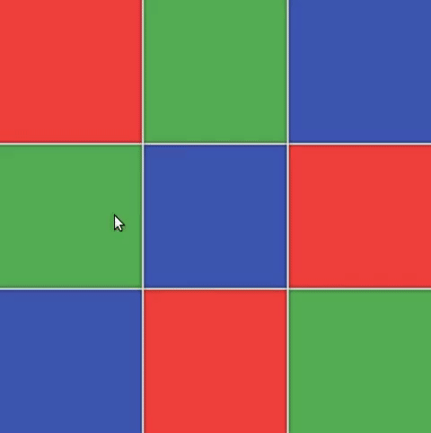

[](https://www.npmjs.com/package/square-me)
![Built With Stencil](https://img.shields.io/badge/-Built%20With%20Stencil-16161d.svg?logo=data%3Aimage%2Fsvg%2Bxml%3Bbase64%2CPD94bWwgdmVyc2lvbj0iMS4wIiBlbmNvZGluZz0idXRmLTgiPz4KPCEtLSBHZW5lcmF0b3I6IEFkb2JlIElsbHVzdHJhdG9yIDE5LjIuMSwgU1ZHIEV4cG9ydCBQbHVnLUluIC4gU1ZHIFZlcnNpb246IDYuMDAgQnVpbGQgMCkgIC0tPgo8c3ZnIHZlcnNpb249IjEuMSIgaWQ9IkxheWVyXzEiIHhtbG5zPSJodHRwOi8vd3d3LnczLm9yZy8yMDAwL3N2ZyIgeG1sbnM6eGxpbms9Imh0dHA6Ly93d3cudzMub3JnLzE5OTkveGxpbmsiIHg9IjBweCIgeT0iMHB4IgoJIHZpZXdCb3g9IjAgMCA1MTIgNTEyIiBzdHlsZT0iZW5hYmxlLWJhY2tncm91bmQ6bmV3IDAgMCA1MTIgNTEyOyIgeG1sOnNwYWNlPSJwcmVzZXJ2ZSI%2BCjxzdHlsZSB0eXBlPSJ0ZXh0L2NzcyI%2BCgkuc3Qwe2ZpbGw6I0ZGRkZGRjt9Cjwvc3R5bGU%2BCjxwYXRoIGNsYXNzPSJzdDAiIGQ9Ik00MjQuNywzNzMuOWMwLDM3LjYtNTUuMSw2OC42LTkyLjcsNjguNkgxODAuNGMtMzcuOSwwLTkyLjctMzAuNy05Mi43LTY4LjZ2LTMuNmgzMzYuOVYzNzMuOXoiLz4KPHBhdGggY2xhc3M9InN0MCIgZD0iTTQyNC43LDI5Mi4xSDE4MC40Yy0zNy42LDAtOTIuNy0zMS05Mi43LTY4LjZ2LTMuNkgzMzJjMzcuNiwwLDkyLjcsMzEsOTIuNyw2OC42VjI5Mi4xeiIvPgo8cGF0aCBjbGFzcz0ic3QwIiBkPSJNNDI0LjcsMTQxLjdIODcuN3YtMy42YzAtMzcuNiw1NC44LTY4LjYsOTIuNy02OC42SDMzMmMzNy45LDAsOTIuNywzMC43LDkyLjcsNjguNlYxNDEuN3oiLz4KPC9zdmc%2BCg%3D%3D&colorA=16161d)

# SquareMe - Universal Resizable Grid

`SquareMe` is a universal grid layout built with [Stencil](http://stenciljs.com). It can be embedded in projects using any framework or even plain HTML. Under the hood `SquareMe` leverages the [`SplitMe`](https://github.com/alesgenova/split-me) component.



## Installing

### Option 1 (HTML)

Add the `SquareMe` script tag to your `index.html`:

```
<script src="https://unpkg.com/square-me/dist/square-me.js"></script>
```

### Option 2 (React / Angular / Vue)

Add `SquareMe` to your project:

```
npm install --save square-me
```

Import `SquareMe` in your `index.js`:

```js
import { defineCustomElements as defineSquareMe } from 'square-me/dist/loader';

defineSquareMe(window);
```

## Basic Usage

Use the `square-me` tag anywhere you like. Set the number of rows and columns in the layout through the `m` and `n` attributes respectively. Set where the inner elements should be placed through the `slot` attribute:

```html
<square-me m="2" n="2">
  <div slot="0 0" class="fill red"></div>
  <div slot="0 1" class="fill green"></div>
  <div slot="1 0" class="fill green"></div>
  <div slot="1 1" class="fill red"></div>
</square-me>

<style>
  .fill {
    height: 100%;
    width: 100%;
  }
</style>
```

## Advanced Usage

`SquareMe` uses [`SplitMe`](https://github.com/alesgenova/split-me) under the hood. Any property/attribute passed to `SquareMe` will be forwarded to the underlying `SplitMe` components.

Simply append a `-h` or `-v` to the attribute name you would use in `SplitMe` and the property will be applied to the horizontal or vertical splitters respectively

```html
<square-me m="2" n="2" sizes-h="0.75, 0.25" sized-v="0.25, 0.75">
  <div slot="0 0" class="fill red"></div>
  <div slot="0 1" class="fill green"></div>
  <div slot="1 0" class="fill green"></div>
  <div slot="1 1" class="fill red"></div>
</square-me>
```

### Properties

| Property    | Attribute     | Description                                                                           | Type                |
| ----------- | ------------- | ------------------------------------------------------------------------------------- | ------------------- |
| `fixedH`    | `fixed-h`     | Prevent columns from being resized                                                    | `boolean`           |
| `fixedV`    | `fixed-v`     | Prevent rows from being resized                                                       | `boolean`           |
| `m`         | `m`           | The number of rows in the grid.                                                       | `number`            |
| `maxSizesH` | `max-sizes-h` | The columns maximum sizes                                                             | `number[] | string` |
| `maxSizesV` | `max-sizes-v` | The rows maximum sizes                                                                | `number[] | string` |
| `minSizesH` | `min-sizes-h` | The columns minimum sizes                                                             | `number[] | string` |
| `minSizesV` | `min-sizes-v` | The rows minimum sizes                                                                | `number[] | string` |
| `n`         | `n`           | The number of columns in the grid.                                                    | `number`            |
| `sizesH`    | `sizes-h`     | The initial column sizes. Acceptable formats are: `"0.33, 0.67"` or `"50%, 25%, 25%"` | `number[] | string` |
| `sizesV`    | `sizes-v`     | The initial row sizes. Acceptable formats are: `"0.33, 0.67"` or `"50%, 25%, 25%"`    | `number[] | string` |
| `throttleH` | `throttle-h`  | The minimum time (in ms) between column resize events while dragging.                 | `number`            |
| `throttleV` | `throttle-v`  | The minimum time (in ms) between row resize events while dragging.                    | `number`            |

### Events

| Event          | Detail       | Description                                              |
| -------------- | ------------ | -------------------------------------------------------- |
| `slotResizedH` | IResizeEvent | Emitted every time dragging causes the columns to resize |
| `slotResizedV` | IResizeEvent | Emitted every time dragging causes the rows to resize    |
